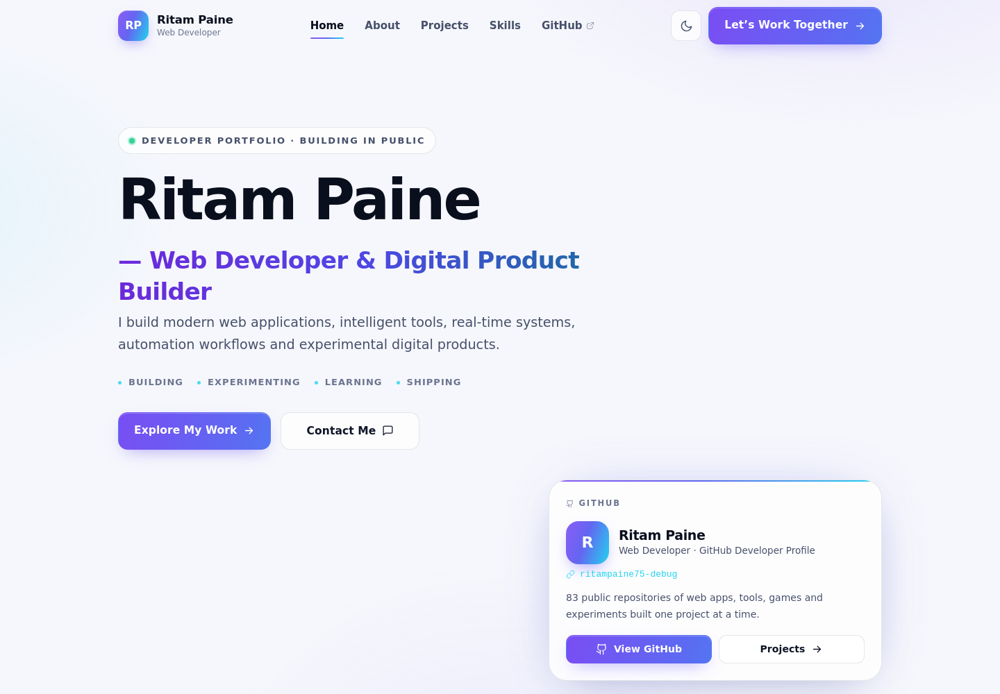
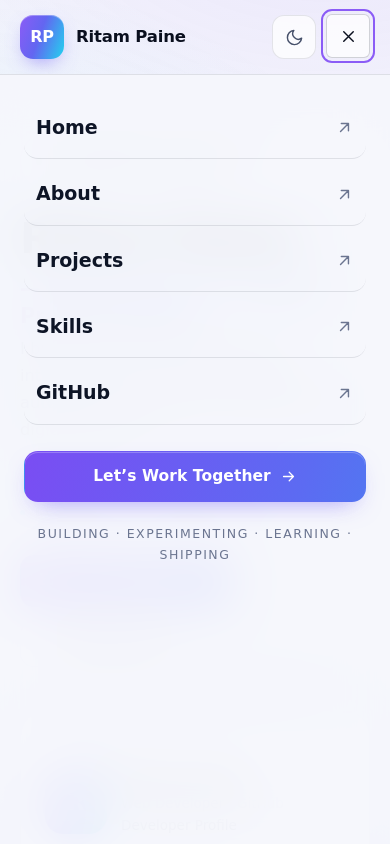
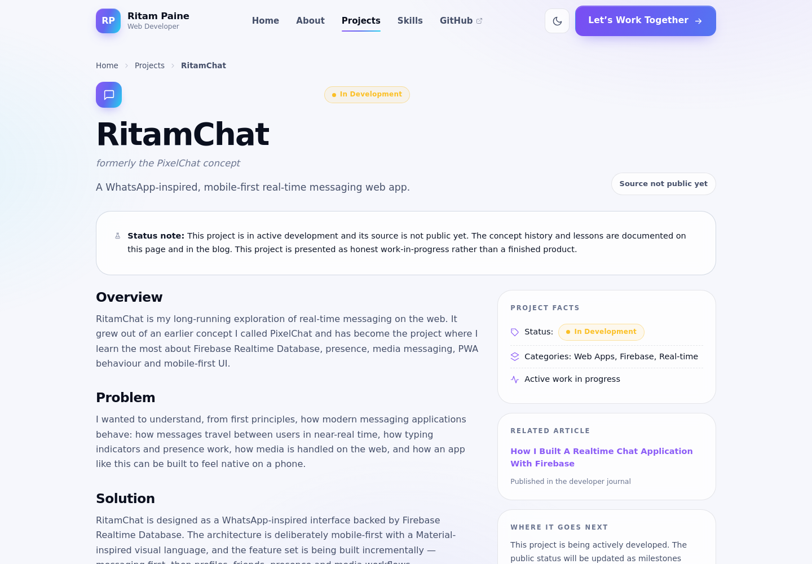

<div align="center">

# Ritam Paine — Web Developer

### Premium personal developer portfolio · Web Developer & Digital Product Builder

**Ritam Paine** is an independent web developer focused on building modern web applications,
AI-powered tools, real-time systems, Firebase-based projects, progressive web applications and
experimental digital products.

[Live Website](https://ritampaine75-debug.github.io/ritam-paine-portfolio/) ·
[GitHub Profile](https://github.com/ritampaine75-debug) ·
[Instagram](https://www.instagram.com/ritam_2024_0)

</div>

---

## About the developer

Ritam Paine is an independent web developer and digital product builder. His development life
revolves around **web development**, **modern UI/UX**, **Firebase**, **real-time applications**,
**AI-powered applications**, **automation**, **progressive web apps**, developer tools,
productivity tools and experimental software.

He shares his work publicly on GitHub and builds a meaningful part of his projects from a phone
using Termux and modern development tooling — a constraint that keeps his interfaces fast,
lightweight and mobile-first.

> Built small. Shipped often. Labelled honestly. Every experiment on this site says exactly what
> it is.

---

## Preview







---

## What I build

| Direction | Examples |
| --- | --- |
| Modern web applications | Mobile-first interfaces, React builds, responsive systems |
| Real-time & Firebase | Messaging concepts, presence, live shared state (Firebase Realtime Database) |
| AI-powered applications | AI chat experiments, assistant-style concepts, guided workflows |
| Tools & utilities | 25-tool PWA hub, browser-based utilities, developer tools |
| Games & interactions | Multiplayer Tic Tac Toe experiment, game logic studies |
| Automation | Scripts, GitHub Actions experiments, workflow automation |

---

## Featured projects

- **[RitamChat](https://ritampaine75-debug.github.io/ritam-paine-portfolio/projects/ritamchat)** —
  WhatsApp-inspired real-time messaging web app concept (in development). Firebase Realtime
  Database, presence, media-messaging concepts and PWA behaviour.
- **[Web Tools Hub](https://ritampaine75-debug.github.io/ritam-paine-portfolio/projects/web-tools-hub)**
  — 25 free browser tools in one mobile-first, offline-ready PWA. Plain HTML/CSS/JS, zero
  dependencies. [Live](https://ritampaine75-debug.github.io/web-tools-hub/)
- **[Tic Tac Toe Multiplayer](https://ritampaine75-debug.github.io/ritam-paine-portfolio/projects/tic-tac-toe-multiplayer)**
  — online multiplayer game experiment around a Firebase backend.
- **[Gmail OTP Verification](https://ritampaine75-debug.github.io/ritam-paine-portfolio/projects/otp-gmail-verification)**
  — React + Firebase OTP email-verification experiment with expiry, attempt limits and resend
  cooldowns.
- **[AI Chat Applications](https://ritampaine75-debug.github.io/ritam-paine-portfolio/projects/ai-chat-applications)**
  — a series of live AI chat experiments wired to language-model APIs.
- **[ShopVerse E-Commerce](https://ritampaine75-debug.github.io/ritam-paine-portfolio/projects/shopverse-ecommerce)**
  — premium e-commerce interface experiment built with HTML, CSS, JavaScript and Firebase.
- Plus concepts explored honestly: **AI Life Planner**, **Sayan**, **Smart Billing & Inventory**.

Every project page states its real status — published, in development, prototype, experiment or
concept — and links to the actual repository when it is public.

---

## Technologies

- **Frontend:** HTML, CSS, JavaScript, React, Responsive Web Design, PWA, modern UI/UX
- **Backend / Database:** Firebase, Firebase Realtime Database, real-time data systems,
  authentication concepts
- **AI & APIs:** AI API integration, LLM-powered applications, API-based development
- **Tools:** Git, GitHub, GitHub Actions, Vite, Tailwind CSS, Termux, modern workflows

---

## Current experiments

- AI-powered room / virtual space builder (3D room design ideas, Blender export workflows)
- AI life planning concepts (bilingual: Bengali and English)
- Smart inventory and small-business workflows
- Personal productivity and digital wellbeing systems
- PWA and Firebase application experiments
- Developer utilities and automation tools

---

## Development philosophy

1. **Ship before it is perfect** — a working product teaches more than a perfect plan.
2. **Simple over clever** — choose what you can still understand in six months.
3. **Real-time is a feature** — add live data on purpose, never by default.
4. **Honest labels** — concepts say “Concept”, experiments say “Experiment”.
5. **Mobile is the default** — if it doesn’t feel right at 360px, it is not done.

---

## About this repository

A production-ready, premium personal portfolio website built with **React + Vite**. It combines a
developer portfolio, personal brand, project archive, technical blog and GitHub identity into one
fast, accessible, mobile-first site.

**Repository description:** *Premium personal portfolio website for Ritam Paine — Web Developer &
Digital Product Builder.*

### Highlights

- Semantic HTML5, clean URLs, canonical URLs, meta/Open Graph/Twitter metadata per page
- JSON-LD structured data: `Person`, `WebSite`, `WebPage`, `BreadcrumbList`, `Article`, and
  `SoftwareApplication`/`Project` where genuinely applicable — no fake ratings or reviews
- Nine SEO-friendly project detail pages with breadcrumbs and related-project internal links
- A technical blog with ten original, project-linked articles
- Dark / light theme that respects `prefers-color-scheme` and persists user choice
- Scroll-reveal animations, scroll-progress bar and reduced-motion support
- Live GitHub section via the public REST API with loading / error / empty / cached states
  (public data only — no tokens)
- Lazy-loaded avatars, minimal dependencies, code-split React vendor chunk

### Repository structure

```
ritam-paine-portfolio/
├── public/
│   ├── favicon.svg
│   ├── icon-192.png · icon-512.png · apple-touch-icon.png
│   ├── og-image.png            # social preview (1200×630)
│   ├── og-images/              # per-project social previews
│   ├── robots.txt
│   ├── sitemap.xml             # regenerated on every build
│   └── manifest.webmanifest
├── scripts/
│   ├── generate-static.mjs     # sitemap generator (runs on build)
│   └── generate-images.py      # regenerate icons + OG images
├── src/
│   ├── components/             # Nav, Footer, cards, GitHub panel, SEO-aware UI
│   ├── sections/               # homepage sections
│   ├── pages/                  # Home, About, Projects, ProjectDetail, Blog, 404
│   ├── data/                   # site config, projects, skills, journey, experiments…
│   ├── articles/               # 10 technical articles (content + metadata)
│   ├── hooks/                  # theme, GitHub data, site meta
│   ├── lib/                    # schema.org builders
│   └── styles/global.css       # full design system (dark + light)
├── index.html
├── vite.config.js
├── package.json
└── .gitignore
```

---

## Local development

```bash
# 1. Clone
git clone https://github.com/ritampaine75-debug/ritam-paine-portfolio.git
cd ritam-paine-portfolio

# 2. Install
npm install

# 3. Develop (local preview)
npm run dev
# → http://localhost:5173

# 4. Production build (regenerates sitemap.xml, builds, writes 404.html)
npm run build

# 5. Preview the production build
npm run preview
```

> Builds run at the GitHub Pages base path by default. For a custom domain or a
> Vercel/Netlify root deploy, use `VITE_BASE_PATH=/ npm run build`.

---

## Deployment

This site deploys to **GitHub Pages**, **Vercel** or **Netlify** — it is a static build.

### GitHub Pages (the simplest — used for this repository)

1. Push this repository to GitHub.
2. Open **Settings → Pages**.
3. Under **Build and deployment**, choose **Source: Deploy from a branch** →
   branch `main`, folder `/ (root)`.
4. Save. Your site is live at
   `https://<username>.github.io/ritam-paine-portfolio/`.
5. SPA deep links work out of the box — the build writes `404.html`.

### Vercel

```bash
npm i -g vercel
vercel            # build command: npm run build
# output directory: dist
```

For a root-URL deploy use `VITE_BASE_PATH=/ npm run build`.

### Netlify

- Build command: `npm run build` (set `VITE_BASE_PATH=/`)
- Publish directory: `dist`

### Custom domain

Change `SITE_URL` in `src/data/site.js` to your domain (e.g. `https://ritam-paine.dev`), rebuild,
and the canonical URLs, Open Graph URLs, robots.txt and sitemap all update automatically. Add the
domain to your hosting provider and set up the DNS record.

---

## Search engine setup (Google / Bing)

The site ships with semantic HTML, per-page metadata, JSON-LD structured data, `robots.txt` and a
self-regenerating `sitemap.xml`. To verify ownership and monitor indexing, follow the step-by-step
guide in [`docs/search-engine-setup.md`](docs/search-engine-setup.md). No ranking is guaranteed —
the goal is a technically strong, indexable, honest foundation.

---

## Contact

- **GitHub:** [github.com/ritampaine75-debug](https://github.com/ritampaine75-debug)
- **Instagram:** [@ritam_2024_0](https://www.instagram.com/ritam_2024_0)
- **Website:** [ritam-paine-portfolio](https://ritampaine75-debug.github.io/ritam-paine-portfolio/)
- **Email:** configure one by setting `contactEmail` in `src/data/site.js` (kept empty on purpose —
  no public email is listed yet).

---

## Honesty & security note

- No jobs, companies, degrees, certifications, awards, clients, revenue, GitHub stars, user counts,
  downloads or years of experience are invented anywhere on this site or in this README.
- Projects without a public repository are clearly labelled **Concept / Experiment**.
- **No API keys, passwords, app passwords, tokens or private credentials live in this repository.**
  Never commit a `.env` file or GitHub token.

## License

[MIT](LICENSE) © Ritam Paine

---

*Designed & developed by Ritam Paine.*
